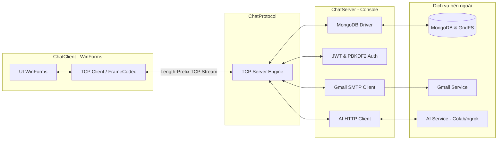
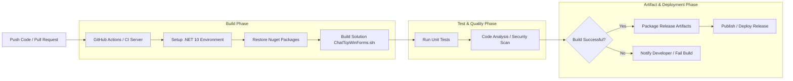

# Chat TCP WinForms

Ứng dụng chat đa phòng C# WinForms dùng TCP thuần, MongoDB (tài khoản người dùng) và
dịch vụ AI riêng (gọi qua HTTP tới AI service đang chạy trên Google Colab/ngrok).
Cấu trúc khá giống với Ứng dụng Discord, Link Tham khảo: https://github.com/discord/discord-open-source
## Cấu trúc solution

```
ChatTcpWinForms.sln
├── ChatProtocol/   # Class Library dùng chung (net10.0) — giao thức tự thiết kế
│   └── Protocol.cs # Envelope + FrameCodec (length-prefix) + các kiểu payload
├── ChatServer/     # Console app (net10.0) — TCP server
└── ChatClient/     # WinForms app (net10.0-windows) — TCP client có giao diện
```

`ChatServer` và `ChatClient` đều tham chiếu (`ProjectReference`) tới `ChatProtocol`,
nên chỉ có **một** định nghĩa message dùng chung cho cả hai bên — tránh lệch giao thức.

### 1. Kiến trúc tổng quan (Architecture Flow)


## Định hướng 

Viết bằng C# tạo 1 winform , cụ thể là folder ChatClient (sẽ được đóng gói thành 1 app install)
Folder Chat Server + ChatProtocol sẽ được host =  bên thứ 3 để tiện 24/7 hoặc tiếp tục localhost depend vào laptop 

## Giao thức (length-prefix framing)

TCP là một **stream**, không tự có ranh giới message. Mỗi message được đóng khung theo
kiểu **length-prefix**: `[4 byte big-endian = độ dài thân][UTF-8 JSON]`. Bên nhận đọc đủ
4 byte đầu để biết cần đọc thêm bao nhiêu byte nữa mới đủ 1 message hoàn chỉnh
(`FrameCodec.ReadAsync`). Cách này an toàn hơn kiểu tách theo `\n` vì JSON không thể vô
tình chứa ký tự xuống dòng làm vỡ message.

Mỗi message là 1 `Envelope { Type, Data }`. `Type` quyết định `Data` nên được đọc thành
kiểu payload nào (`envelope.As<T>()`), ví dụ: `join` → `JoinRequest`, `chat` (server gửi
xuống) → `ChatMessage`, `room-list` → `RoomListResponse`, v.v. — xem đầy đủ trong
`ChatProtocol/Protocol.cs`.

## Cấu hình

1. Trong `ChatServer/`, sao chép `.env.example` thành `.env`.
2. Điền `MONGODB_URI` bằng connection string MongoDB của bạn. Server tự tạo/dùng 2
   collection: `users` (đăng ký/đăng nhập, mật khẩu hash bằng PBKDF2 + salt) và
   `messages` (lịch sử chat của từng phòng — mỗi khi vào phòng, server gửi lại 50 tin
   nhắn gần nhất qua message `history`).
3. Điền `EMAIL_USER` bằng Gmail gửi OTP và `EMAIL_APP_PASSWORD` bằng App Password
   16 ký tự của Gmail. Không dùng mật khẩu Gmail thông thường. Khi bấm **Tạo tài khoản**,
   server sẽ gửi OTP đến email người đăng ký và chỉ lưu tài khoản sau khi xác nhận đúng mã.
4. Điền `JWT_SECRET` bằng chuỗi bí mật dài, dùng để ký và kiểm tra token OTP trong thời hạn
   10 phút. Token chỉ được giữ ở server; client không nhận JWT.
5. Điền `AI_SERVICE_URL` bằng URL AI service (Colab/ngrok) đã dùng ở bản Node. Khi
   gửi `/ai câu hỏi` trong khung chat, server gọi `POST {AI_SERVICE_URL}/generate` với
   JSON `{ prompt, room, username }`, chờ JSON phản hồi `{ reply }`, rồi broadcast câu
   trả lời vào phòng dưới tên `AI`. Trong ô chat có thể gọi AI bằng `@AI câu hỏi` hoặc
   `/AI câu hỏi` (không phân biệt chữ hoa/thường).

**Không đưa `.env` thật lên Git hoặc nộp kèm bài**, vì nó chứa mật khẩu MongoDB/API key
thật — chỉ nộp `.env.example`. `.gitignore` đã loại trừ `.env` sẵn.

## Chạy

Yêu cầu: Visual Studio 2022 (hoặc mới hơn) + >= .NET 8 SDK.

1. Mở `ChatTcpWinForms.sln` — sẽ thấy đủ 3 project: `ChatProtocol`, `ChatServer`, `ChatClient`.
2. Chuột phải solution → *Restore NuGet Packages* (cài `MongoDB.Driver` cho `ChatServer`).
3. Sao chép `ChatServer/.env.example` thành `ChatServer/.env`, rồi điền `JWT_SECRET`,
   `EMAIL_USER`, `EMAIL_APP_PASSWORD` cùng các cấu hình còn lại.
4. Chạy `ChatServer` trước (console in `Dang lang nghe TCP tai cong 5050 ...`).
5. Chạy 1–2 instance `ChatClient`. Đăng ký tài khoản mới (nút **Tạo tài khoản**) hoặc đăng nhập
   nếu đã có, rồi vào phòng `General` (hoặc tạo phòng mới) để test chat nhiều người,
   danh sách online, typing indicator, gọi AI bằng `@AI <câu hỏi>`/`/AI <câu hỏi>`,
   nhắn tin riêng, và hồ sơ người dùng. Nhấp phải hoặc bấm đúp một người trong danh sách
   online để mở hồ sơ hay nhắn riêng; bấm tên của mình trên header để xem hồ sơ cá nhân.
   Dùng nút kẹp giấy trong ô soạn tin để gửi tệp tối đa **12 MB**. Tệp được lưu trong
   MongoDB GridFS (`chat_files.files` và `chat_files.chunks`). Ngay trong lịch sử chat sẽ
   có thẻ `📎 tên tệp · dung lượng [Tải xuống]`; ảnh PNG/JPG/JPEG có thumbnail xem trước.
   Sidebar phải vẫn giữ danh sách tệp để tải lại. Khi upload/download, thanh tiến trình
   phía dưới khung chat hiển thị phần trăm đã truyền.

## Tin nhắn offline

Khi người nhận DM đang offline, server lưu tin nhắn vào collection `offline_direct_messages`.
Khi họ đăng nhập và mở cửa sổ chat, client tự nhận các tin chưa đọc rồi server xóa chúng khỏi
hàng đợi. DM gửi thành công khi người nhận offline vẫn hiện trong lịch sử của người gửi.

## Luồng CI/CD Pipeline



## Wireshark

Lọc `tcp.port == 5050`, dùng **Follow TCP Stream** để xem gói tin thật — bạn sẽ thấy
4 byte độ dài đứng trước mỗi khối JSON, đúng như mô tả ở phần "Giao thức" bên trên.


## Ý tưởng nhóm
- UDP video call extension
- Voicechat real-time

