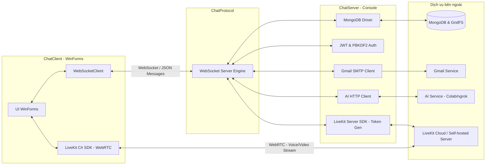
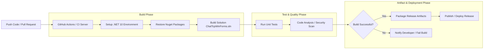

# Chat WebSocket WinForms

Ứng dụng chat đa phòng viết bằng **C# WinForms**, sử dụng **WebSocketClient** để giao tiếp giữa client và server, **MongoDB** để lưu trữ tài khoản người dùng và dữ liệu chat, cùng với **dịch vụ AI riêng** được gọi qua HTTP tới AI service đang chạy trên Google Colab/ngrok.

Giao diện và mô hình hoạt động được định hướng tương tự các ứng dụng chat hiện đại như Discord.

Link tham khảo: https://github.com/discord/discord-open-source

---

## Cấu trúc solution

```text
ChatTcpWinForms.sln
├── ChatProtocol/   # Class Library dùng chung (net10.0) — giao thức tự thiết kế
│   └── Protocol.cs # Envelope + các kiểu payload dùng chung
├── ChatServer/     # Console app (net10.0) — WebSocket server
└── ChatClient/     # WinForms app (net10.0-windows) — WebSocket client có giao diện
```

`ChatServer` và `ChatClient` đều tham chiếu (`ProjectReference`) tới `ChatProtocol`, nên chỉ có **một định nghĩa message dùng chung cho cả hai bên**, giúp tránh tình trạng client và server sử dụng giao thức không đồng nhất.

---

## 1. Kiến trúc tổng quan (Architecture Flow)


```mermaid
flowchart LR
    subgraph Client [ChatClient - WinForms]
        A[UI WinForms] <--> B[WebSocketClient]
        A <--> LK_Client[LiveKit C# SDK - WebRTC]
    end

    subgraph Protocol [ChatProtocol]
        B <-->|WebSocket / JSON Messages| C[WebSocket Server Engine]
    end

    subgraph Server [ChatServer - Console]
        C <--> D[MongoDB Driver]
        C <--> E[JWT & PBKDF2 Auth]
        C <--> F[Gmail SMTP Client]
        C <--> G[AI HTTP Client]
        C <--> H[LiveKit Server SDK - Token Gen]
    end

    subgraph External [Dịch vụ bên ngoài]
        D <--> DB[(MongoDB & GridFS)]
        F --> SMTP[Gmail Service]
        G <--> AI[AI Service - Colab/ngrok]
        H <--> LK_Server[LiveKit Cloud / Self-hosted Server]
        LK_Client <-->|WebRTC - Voice/Video Stream| LK_Server
    end
```

### Luồng hoạt động cơ bản

```text
ChatClient
    │
    │ WebSocket
    ▼
ChatServer
    │
    ├── MongoDB
    ├── Gmail SMTP
    ├── AI Service
    └── LiveKit
```

Client duy trì kết nối WebSocket tới server. Các thao tác như đăng nhập, tham gia phòng, gửi tin nhắn, typing indicator, nhắn tin riêng, gửi file... đều được thực hiện thông qua các message trên kết nối WebSocket.

---

## 2. Định hướng

Ứng dụng được chia thành 3 project chính:

* **ChatClient**: ứng dụng C# WinForms dành cho người dùng cuối, sau này sẽ được đóng gói thành một bộ cài đặt riêng.
* **ChatServer**: WebSocket server xử lý kết nối, xác thực, phòng chat, tin nhắn, file, AI và các dịch vụ liên quan.
* **ChatProtocol**: thư viện dùng chung giữa client và server, chứa các định nghĩa message và payload.

### Phương án triển khai

**ChatClient** sẽ được đóng gói thành một ứng dụng cài đặt trên máy người dùng.

**ChatServer + ChatProtocol** có thể:

* Chạy **localhost** để phát triển và kiểm thử.
* Host trên một dịch vụ bên thứ ba để server hoạt động **24/7**.
* Kết nối tới MongoDB Atlas để lưu trữ dữ liệu từ xa.
* Kết nối tới AI Service thông qua HTTP/ngrok.
* Kết nối tới LiveKit Cloud hoặc LiveKit Server tự host cho chức năng voice/video.

---

# 3. Giao thức WebSocket

Ứng dụng sử dụng **WebSocket** thay cho TCP socket thuần túy.

WebSocket cung cấp một kết nối hai chiều (**full-duplex**) giữa `ChatClient` và `ChatServer`. Sau khi kết nối được thiết lập, cả client và server đều có thể chủ động gửi message cho phía còn lại mà không cần tạo một kết nối mới cho từng message.

```text
ChatClient                         ChatServer
    │                                  │
    │──── WebSocket Connect ──────────>│
    │                                  │
    │<──── Connection Accepted ────────│
    │                                  │
    │──── chat message ───────────────>│
    │                                  │
    │<──── broadcast message ──────────│
    │                                  │
    │──── typing ─────────────────────>│
    │                                  │
    │<──── online users ───────────────│
    │                                  │
```

WebSocket đã có cơ chế framing riêng ở tầng giao thức, vì vậy ứng dụng **không cần tự triển khai length-prefix framing `[4 byte length][JSON]` như phiên bản TCP trước đây**.

Các message của ứng dụng vẫn được tổ chức dưới dạng JSON và sử dụng `Envelope` để xác định loại message.

Ví dụ:

```json
{
  "type": "chat",
  "data": {
    "room": "General",
    "username": "Duckkeip",
    "message": "Hello!"
  }
}
```

`Type` quyết định `Data` được deserialize thành kiểu payload nào thông qua:

```csharp
envelope.As<T>()
```

Ví dụ:

| Type        | Payload            | Chức năng           |
| ----------- | ------------------ | ------------------- |
| `login`     | `AuthRequest`      | Đăng nhập           |
| `register`  | `RegisterRequest`  | Đăng ký             |
| `join`      | `JoinRequest`      | Tham gia phòng      |
| `chat`      | `ChatMessage`      | Tin nhắn phòng      |
| `room-list` | `RoomListResponse` | Danh sách phòng     |
| `history`   | `HistoryResponse`  | Lịch sử tin nhắn    |
| `typing`    | `TypingMessage`    | Thông báo đang nhập |
| `dm`        | `DirectMessage`    | Tin nhắn riêng      |
| ...         | ...                | ...                 |

Toàn bộ các kiểu payload được định nghĩa tập trung trong:

```text
ChatProtocol/Protocol.cs
```

Điều này giúp `ChatClient` và `ChatServer` sử dụng cùng một cấu trúc dữ liệu.

---

# 4. Cấu hình

## 4.1. MongoDB

Trong `ChatServer/`, sao chép:

```text
.env.example
```

thành:

```text
.env
```

Sau đó điền:

```env
MONGODB_URI=your-mongodb-connection-string
```

Server sử dụng MongoDB để lưu trữ:

* Tài khoản người dùng.
* Tin nhắn.
* Tin nhắn riêng.
* Tin nhắn offline.
* File upload thông qua GridFS.
* Các dữ liệu liên quan khác.

Server tự tạo/dùng collection:

```text
users
messages
offline_direct_messages
```

và các collection GridFS:

```text
chat_files.files
chat_files.chunks
```

Mật khẩu người dùng không được lưu trực tiếp mà được hash bằng:

```text
PBKDF2 + Salt
```

Khi người dùng vào phòng, server gửi lại **50 tin nhắn gần nhất** thông qua message:

```text
history
```

---

## 4.2. Gmail SMTP và OTP

Điền thông tin Gmail vào `.env`:

```env
EMAIL_USER=your-email@gmail.com
EMAIL_APP_PASSWORD=your-app-password
```

`EMAIL_APP_PASSWORD` phải là **App Password 16 ký tự của Google**, không sử dụng mật khẩu Gmail thông thường.

Khi người dùng bấm **Tạo tài khoản**, server sẽ:

1. Nhận thông tin đăng ký.
2. Tạo OTP.
3. Gửi OTP tới email.
4. Chờ người dùng nhập OTP.
5. Kiểm tra OTP.
6. Chỉ tạo/lưu tài khoản sau khi OTP hợp lệ.

OTP có thời hạn:

```text
10 phút
```

---

## 4.3. JWT Secret

Điền:

```env
JWT_SECRET=your-long-random-secret
```

JWT được sử dụng để ký và kiểm tra token OTP trong thời hạn 10 phút.

Token chỉ được xử lý ở phía server; client không nhận JWT dùng cho việc xác thực OTP.

---

## 4.4. AI Service

Điền URL của AI service:

```env
AI_SERVICE_URL=https://your-ngrok-url.ngrok-free.app
```

AI service có thể được chạy trên:

* Google Colab
* Ngrok
* Server riêng

Khi người dùng gửi:

```text
/ai câu hỏi
```

hoặc:

```text
@AI câu hỏi
```

server sẽ gọi:

```http
POST {AI_SERVICE_URL}/generate
```

với JSON:

```json
{
  "prompt": "câu hỏi",
  "room": "General",
  "username": "Duckkeip"
}
```

AI service trả về:

```json
{
  "reply": "Câu trả lời của AI"
}
```

Server sau đó broadcast câu trả lời vào phòng dưới tên:

```text
AI
```

Việc gọi AI không phân biệt chữ hoa/chữ thường.

Ví dụ:

```text
@AI giải thích WebSocket là gì?
```

hoặc:

```text
/AI giải thích WebSocket là gì?
```

---

## 4.5. Bảo mật `.env`

**Không đưa `.env` thật lên Git hoặc nộp kèm bài**, vì file này có thể chứa:

* MongoDB connection string.
* Gmail App Password.
* JWT Secret.
* AI service URL/API key.
* Các thông tin cấu hình riêng tư khác.

Chỉ đưa:

```text
.env.example
```

vào repository.

`.gitignore` đã loại trừ `.env`.

---

# 5. Chạy chương trình

## Yêu cầu

* Visual Studio 2022 hoặc mới hơn.
* .NET SDK >= 8.
* MongoDB / MongoDB Atlas.
* Gmail App Password nếu sử dụng chức năng OTP.
* AI Service nếu muốn sử dụng AI.
* LiveKit nếu muốn sử dụng voice/video.

---

## Bước 1 — Mở solution

Mở:

```text
ChatTcpWinForms.sln
```

Trong solution sẽ có:

```text
ChatProtocol
ChatServer
ChatClient
```

---

## Bước 2 — Restore NuGet Packages

Chuột phải vào Solution:

```text
Restore NuGet Packages
```

Các package cần thiết sẽ được restore cho từng project.

---

## Bước 3 — Cấu hình server

Trong:

```text
ChatServer/
```

sao chép:

```text
.env.example
```

thành:

```text
.env
```

Sau đó điền:

```env
MONGODB_URI=...
JWT_SECRET=...
EMAIL_USER=...
EMAIL_APP_PASSWORD=...
AI_SERVICE_URL=...
```

---

## Bước 4 — Chạy ChatServer

Chạy project:

```text
ChatServer
```

Server sẽ khởi động WebSocket server và chờ client kết nối.

Ví dụ:

```text
Dang lang nghe WebSocket tai cong 5050 ...
```

---

## Bước 5 — Chạy ChatClient

Chạy một hoặc nhiều instance của:

```text
ChatClient
```

Client sẽ kết nối tới WebSocket server.

Sau khi kết nối thành công, người dùng có thể:

* Đăng ký tài khoản.
* Đăng nhập.
* Vào phòng `General`.
* Vào phòng `Random`.
* Vào phòng `Tech`.
* Tạo phòng mới.
* Chat với nhiều người.
* Xem danh sách người dùng online.
* Sử dụng typing indicator.
* Gọi AI.
* Nhắn tin riêng.
* Xem hồ sơ người dùng.
* Gửi file.
* Sử dụng voice/video thông qua LiveKit.

---

# 6. Chức năng chính

## Chat đa phòng

Server hỗ trợ nhiều phòng chat, mặc định gồm:

```text
General
Random
Tech
```

Người dùng có thể chuyển đổi giữa các phòng và nhận lịch sử tin nhắn của phòng.

---

## Danh sách người dùng online

Client hiển thị danh sách người dùng đang online.

Có thể:

* Nhấp phải vào người dùng.
* Bấm đúp vào người dùng.
* Mở hồ sơ.
* Bắt đầu cuộc trò chuyện riêng.

Người dùng cũng có thể bấm vào tên của mình trên header để xem hồ sơ cá nhân.

---

## Typing Indicator

Khi người dùng đang nhập tin nhắn, client gửi thông báo tới server.

Server broadcast trạng thái đó cho những người dùng khác trong phòng.

Ví dụ:

```text
Duckkeip đang nhập...
```

---

# 7. Tin nhắn riêng (Direct Message)

Hệ thống hỗ trợ nhắn tin riêng giữa hai người dùng.

```text
User A
   │
   │ Direct Message
   ▼
ChatServer
   │
   ▼
User B
```

Nếu User B đang online, message được chuyển trực tiếp tới client của User B.

Nếu User B đang offline, server sẽ lưu message vào:

```text
offline_direct_messages
```

Khi User B đăng nhập lại và mở cửa sổ chat, client tự nhận các tin nhắn chưa đọc.

Sau khi tin nhắn offline được gửi tới client, server sẽ xóa chúng khỏi hàng đợi.

Tin nhắn DM gửi thành công khi người nhận offline vẫn được giữ lại trong lịch sử của người gửi.

---

# 8. Gửi file

Người dùng có thể sử dụng nút kẹp giấy trong ô soạn tin để gửi file.

Giới hạn:

```text
12 MB / file
```

File được lưu bằng:

```text
MongoDB GridFS
```

Các collection GridFS:

```text
chat_files.files
chat_files.chunks
```

Trong lịch sử chat, file được hiển thị dưới dạng:

```text
📎 tên_tệp · dung_lượng [Tải xuống]
```

Các file ảnh:

```text
PNG
JPG
JPEG
```

có thumbnail xem trước.

Sidebar bên phải vẫn giữ danh sách file để người dùng có thể tải lại.

Trong quá trình upload/download, thanh tiến trình phía dưới khung chat hiển thị phần trăm dữ liệu đã được truyền.

---

# 9. AI Chat

AI được tích hợp trực tiếp vào hệ thống chat.

Người dùng có thể gọi AI bằng:

```text
@AI câu hỏi
```

hoặc:

```text
/AI câu hỏi
```

Ví dụ:

```text
@AI giải thích sự khác nhau giữa TCP và WebSocket
```

Server nhận message và gửi HTTP request tới AI Service.

```text
ChatClient
    │
    │ WebSocket
    ▼
ChatServer
    │
    │ HTTP POST /generate
    ▼
AI Service
    │
    │ { reply }
    ▼
ChatServer
    │
    │ WebSocket broadcast
    ▼
Chat Room
```

AI trả lời vào phòng chat dưới tên:

```text
AI
```

---

# 10. Xác thực tài khoản

Hệ thống hỗ trợ:

```text
Đăng ký
Đăng nhập
OTP Email
Quên mật khẩu
```

Mật khẩu được xử lý bằng:

```text
PBKDF2
+
Salt
```

Không lưu mật khẩu dạng plain text trong MongoDB.

Luồng đăng ký:

```text
Nhập username
       │
       ▼
Nhập password
       │
       ▼
Nhập email
       │
       ▼
Server tạo OTP
       │
       ▼
Gửi OTP qua Gmail
       │
       ▼
Người dùng nhập OTP
       │
       ▼
Server xác thực
       │
       ▼
Tạo tài khoản
```

---

# 11. WebSocket thay cho TCP

Phiên bản hiện tại sử dụng **WebSocketClient** thay cho TCP socket + length-prefix framing.

### Kiến trúc cũ

```text
Client
  │
  │ TCP Stream
  ▼
Server
  │
  └── [4 byte length][JSON]
```

### Kiến trúc hiện tại

```text
Client
  │
  │ WebSocket
  ▼
Server
  │
  └── JSON Message
```

WebSocket cung cấp sẵn cơ chế framing và hỗ trợ giao tiếp hai chiều, do đó ứng dụng không cần tự quản lý ranh giới message bằng 4 byte độ dài như phiên bản TCP trước đây.

`ChatProtocol` vẫn được giữ lại để định nghĩa cấu trúc message dùng chung giữa client và server.

---

# 12. CI/CD Pipeline


```mermaid
flowchart LR
    A[Push Code / Pull Request] --> B[GitHub Actions / CI Server]
    
    subgraph Build Phase
        B --> C[Setup .NET 10 Environment]
        C --> D[Restore Nuget Packages]
        D --> E[Build Solution ChatTcpWinForms.sln]
    end

    subgraph Test & Quality Phase
        E --> F[Run Unit Tests]
        F --> G[Code Analysis / Security Scan]
    end

    subgraph Artifact & Deployment Phase
        G --> H{Build Successful?}
        H -- Yes --> I[Package Release Artifacts]
        H -- No --> J[Notify Developer / Fail Build]
        I --> K[Publish / Deploy Release]
    end
```

Pipeline dự kiến gồm các bước:

1. Push code / Pull Request.
2. Setup môi trường .NET.
3. Restore NuGet packages.
4. Build solution.
5. Chạy Unit Test.
6. Code Analysis.
7. Security Scan.
8. Package release.
9. Deploy release.

Nếu build hoặc test thất bại, pipeline sẽ dừng và thông báo cho developer.

---

# 13. Kiểm tra WebSocket

Có thể sử dụng các công cụ kiểm tra network để quan sát kết nối WebSocket giữa client và server.

Thay vì sử dụng:

```text
tcp.port == 5050
```

và kiểm tra length-prefix TCP như phiên bản cũ, có thể kiểm tra quá trình:

```text
WebSocket Handshake
        ↓
WebSocket Connection
        ↓
WebSocket Messages
        ↓
JSON Payload
```

Trong môi trường phát triển, có thể sử dụng các công cụ debug/network inspection để kiểm tra request, response và message được truyền giữa client và server.

---

# 14. Ý tưởng nhóm

## UDP Video Call Extension

Ý tưởng mở rộng chức năng video call sử dụng công nghệ WebRTC.

Tham khảo:

https://github.com/livekit/livekit

Kiến trúc dự kiến:

```text
ChatClient
    │
    │ WebSocket
    ▼
ChatServer
    │
    │ Token
    ▼
LiveKit
    │
    │ WebRTC
    ▼
ChatClient
```

Server chịu trách nhiệm tạo token và quản lý session, trong khi dữ liệu voice/video được truyền thông qua WebRTC.

---

## Voice Chat Real-time

Tích hợp voice chat real-time vào hệ thống chat.

Người dùng có thể:

* Tham gia voice room.
* Rời voice room.
* Bật/tắt microphone.
* Giao tiếp voice real-time với các thành viên khác.

LiveKit được sử dụng làm nền tảng xử lý WebRTC cho voice/video.

---

# 15. Công nghệ sử dụng

| Thành phần      | Công nghệ            |
| --------------- | -------------------- |
| Client          | C# WinForms          |
| Server          | C# .NET              |
| Protocol        | WebSocket + JSON     |
| Shared Protocol | C# Class Library     |
| Database        | MongoDB              |
| File Storage    | MongoDB GridFS       |
| Authentication  | PBKDF2 + Salt        |
| OTP             | Gmail SMTP           |
| Token           | JWT                  |
| AI              | HTTP AI Service      |
| AI Hosting      | Google Colab / ngrok |
| Voice/Video     | LiveKit + WebRTC     |
| CI/CD           | GitHub Actions       |
| Version Control | Git / GitHub         |

---

# 16. Tổng quan hệ thống

```text
                         ┌─────────────────────┐
                         │      ChatClient     │
                         │      WinForms       │
                         └──────────┬──────────┘
                                    │
                              WebSocket
                                    │
                                    ▼
                         ┌─────────────────────┐
                         │     ChatServer      │
                         │      .NET 10        │
                         └──────────┬──────────┘
                                    │
              ┌─────────────────────┼─────────────────────┐
              │                     │                     │
              ▼                     ▼                     ▼
       ┌─────────────┐       ┌─────────────┐       ┌─────────────┐
       │   MongoDB   │       │ AI Service  │       │   LiveKit   │
       │  + GridFS   │       │ Colab/ngrok │       │   WebRTC    │
       └─────────────┘       └─────────────┘       └─────────────┘
              │                     │                     │
              ▼                     ▼                     ▼
          Accounts               AI Chat             Voice/Video
          Messages
          Files
          Offline DM
```

---

## License

Project được phát triển cho mục đích học tập và nghiên cứu.

## Deployment

- **Server:** Host tại [Render](https://render.com)
- **Client:** Public packaged Client — [Tải ChatClient (.zip)](./RE-CHAT.zip)
